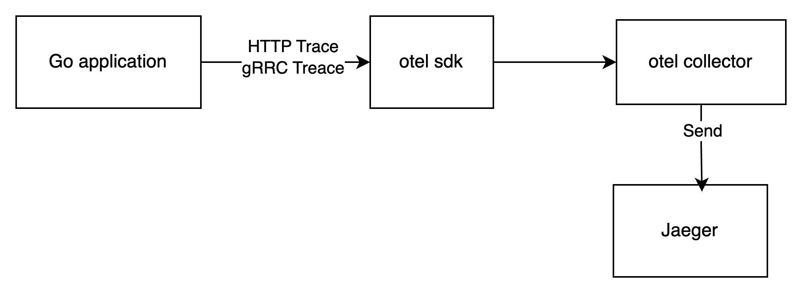
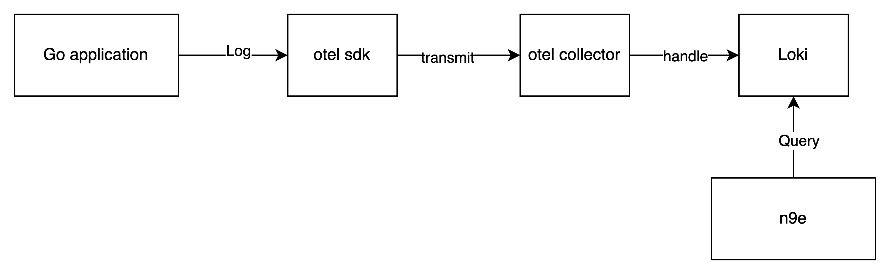

# 字节青训营Tiktok电商项目

## 架构设计
1. 重网关: 使用云原生网关Higress, 外部流量进入到应用的第一道关, 负责CORS, 限流,熔断, 降级, 校验, 重试, 负载, 重定向等作用
2. 职责: 前端注重交互, 后端注重功能, 把复杂的数据逻辑交给后端. 提高交付速度
3. 安全性: 外网强调信息安全, 外网的安全使用认证和授权, 内网的服务使用身份认证和授权
4. 拆分服务: 项目服务明确, 直接使用微服务架构, 单独编写各个微服务, 外部使用HTTP请求, 内部使用RPC
5. 可观测: 监测跟踪程序的日志/指标/链路
6. 监控: 监控各个应用,数据库状态,操作系统,第三方应用的各个指标/日志

### 整体设计

### 选型
#### Backend
- 语言: Golang
- 数据库: Postgres
- 缓存: Redis/CDN

关键工具库:
- redis/go-redis
- sqlc
- jwt

#### Frontend
- 语言: TypeScript
- 框架: React

#### Ops
- 环境: Kubernetes
- 打包: Docker buildx
- 镜像存储: TCR
- 静态文件存储: Minio
- 应用数据库存储: Postgres
- 分布式存储: longhorn
- 时序数据库存储: VictoriaMetrics
- CI: Github Actions
- CD: ArgoCD
- API/微服务/安全网关: Higress
- 鉴权/认证: Casdoor
- 注册/发现/配置中心: Consul

## 设计
### 后端设计
TODO

### 数据库设计:
1. 动静分离: 区分经常更新的字段与不经常更新的字段进行分表设计, 对这个高频更新的表进行缓存, 减少穿透和雪崩, 当频繁更新这些热点表时, 数据库就会缓存这些表的行
2. 约束设计: 数据库不负责业务约束, 由应用设计并限制
3. ID设计: 每个表都有一个id字段和雪花id字段, id字段不能在任何的业务中使用, 只负责插入, 提供插入性能. 使用雪花id字段来定位

## Ops
### 追踪

### 指标
TODO

### 日志

